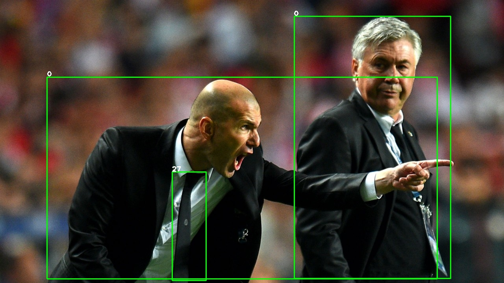

# Transform Onnx to TensorRT（trt） ，especially for yolov8

The Pytorch implementation is [https://github.com/ultralytics/ultralytics](https://github.com/ultralytics/ultralytics).

## onnx model

Only support onnx(opset=12)

or you can download  onnx model from here [z16b](https://pan.baidu.com/s/1KzJ3-15LrPnWjavnqeWsTg)

## How to Run, yolov8n as example

1. Modify the tensorrt cuda opencv path in CMakeLists.txt

   ```
   #cuda 
   include_directories(/mnt/Gu/softWare/cuda-11.0/targets/x86_64-linux/include)
   link_directories(/mnt/Gu/softWare/cuda-11.0/targets/x86_64-linux/lib)

   #tensorrt 
   include_directories(/mnt/Gpan/tensorRT/TensorRT-8.2.0.6/include/)
   link_directories(/mnt/Gpan/tensorRT/TensorRT-8.2.0.6/lib/)
   ```
2. build

   ```
   1. mkdir build
   2. cd build
   3. cmake ..
   4. make

   ```
3. onnx  to tensorrt model

   ```
   ./onnx2trt/onnx2trt  ../onnx_model/yolov8n.onnx ./yolov8n.trt  1

   ```
4. inference

   ```
   ./yolov8 ./yolov8n.trt  ../samples/
   ```

   The results are saved in the build folder.

   

## translate labels'yamel to txt
  ```
./labelsyaml2txt/labelsyaml2txt ../coco128.yaml ../coco128.txt
  ```

## use given model
If you want to use my trt model. Please extract face01.zip in order to deploy face detection or extract coco128.zip in order to deploy coco detection first.

## contact
If you are finding yolov5 tensorrt or deploy trt with cameras, or you have better idea,  
Please contact with @13046311074.163.com. Thanks for your supports and stars; 
